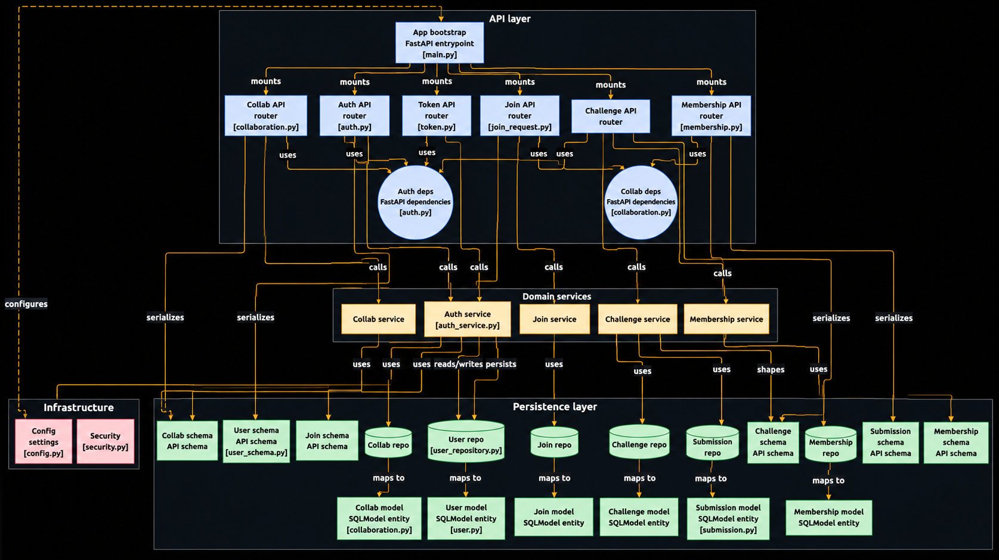

# 🚀 Smart College Hub

**A full-stack coding challenge and collaboration platform built for college students.**

Smart College Hub helps students and teachers connect through coding challenges, project collaborations, and structured team building — backed by a scalable, production-grade FastAPI service and a modern React frontend.

<p align="left">
  
  
  
</p>

---


## 🧭 Overview

Smart College Hub is designed to solve a simple problem: college students learning to code rarely have a single place to **practice, compete, and collaborate** with peers in a structured way. This platform brings coding challenges, leaderboards, and project/study-group formation together under one roof, with an authentication and authorization system solid enough to support real multi-role usage (students, teachers, and admins).

The backend is built with a clean layered architecture (Router → Service → Repository) so business logic stays decoupled from HTTP and database concerns — making the codebase easy to test, extend, and reason about.

---

## ✨ Features

### 🔐 Authentication & Security
- User registration and login
- JWT-based authentication (access + refresh tokens)
- Secure logout via Redis token blocklist
- Role-based access control (student, teacher, admin-ready)

### 💻 Coding Challenges
- Create and manage coding challenges
- Submit solutions
- View leaderboards
- Track personal submission history

### 🤝 Collaboration System
- Create collaboration groups (projects / study groups)
- Join and manage members
- Role-based group control (owner, member)
- Structured team formation for projects

### ⚙️ Backend Architecture
- Clean layered architecture (Router → Service → Repository)
- Async database access using SQLModel
- Alembic migrations for schema management
- Redis integration for token lifecycle management

---

## 🧱 Tech Stack

| Layer          | Technology              |
|----------------|-------------------------|
| API Framework  | FastAPI (async)         |
| ORM            | SQLModel / SQLAlchemy   |
| Database       | PostgreSQL              |
| Migrations     | Alembic                 |
| Caching/Tokens | Redis                   |
| Auth           | PyJWT, Passlib          |


---

## 🏗️ Architecture

```
Client (React)
     │
     ▼
 ┌─────────┐     ┌─────────┐     ┌────────────┐
 │ Router  │ --> │ Service │ --> │ Repository │ --> PostgreSQL
 └─────────┘     └─────────┘     └────────────┘
     │
     ▼
   Redis (token blocklist / caching)
```

Each layer has a single responsibility:
- **Router** — request/response handling, validation
- **Service** — business logic, orchestration
- **Repository** — database queries and persistence

---


## 🚀 Getting Started

### Prerequisites
- Python 3.11+
- PostgreSQL 14+
- Redis 6+
- Node.js 18+ (for the frontend)


## 🤖 MCP Integration

Accessible to MCP-compatible AI assistants (Cursor, Claude Desktop, Windsurf, Cline, VS Code) via
[GitMCP](https://gitmcp.io/Arjun-Bhattarai/LLMs).

### Configuration

```json
{
  "servers": {
    "LLMs Docs": {
      "type": "sse",
      "url": "https://gitmcp.io/Arjun-Bhattarai/Smart-College-hub"
    }
  }
}
```

## Architecture

The following diagram illustrates the backend architecture and request flow of Smart College Hub.


