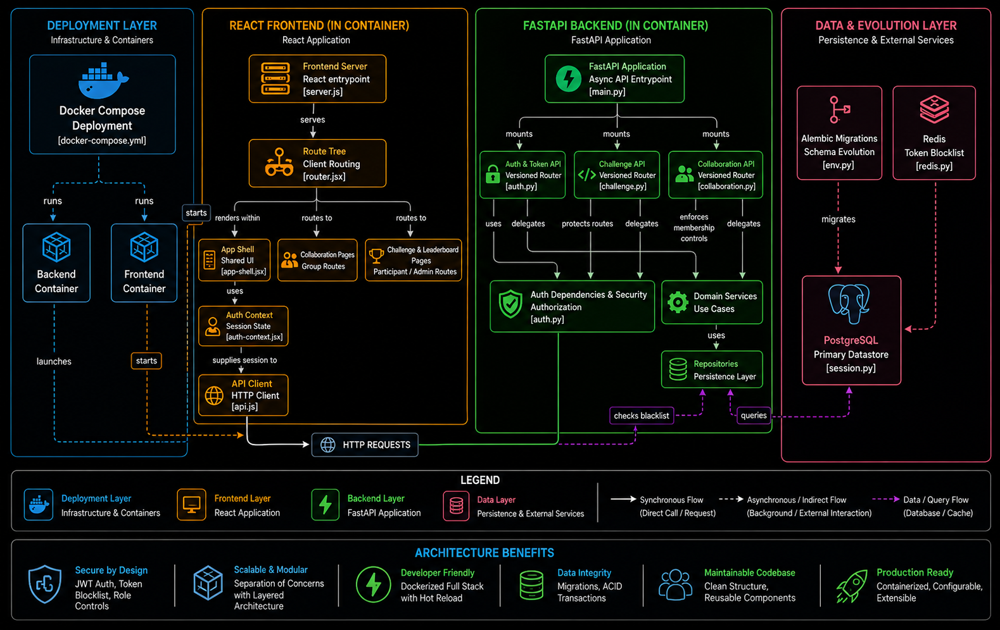

# Smart College Hub

Smart College Hub is a full-stack college collaboration platform with a FastAPI backend and a React/Vite frontend. The current implementation focuses on authentication, coding challenges, submissions, leaderboards, and collaboration management.

## Current scope

The repository currently includes the following working areas:

- Authentication and user management
- Role-based access control for user, student, teacher, and admin
- Coding challenges with create, list, detail, submit, review, and delete flows
- Challenge submissions and a leaderboard
- Collaboration creation, updates, deletion, join requests, and membership management
- Docker-based local development with backend, frontend, PostgreSQL, and Redis services

## Implemented features

### Authentication

The backend exposes authentication routes for:

- signup
- login
- logout
- profile retrieval
- user listing for admins

Authentication uses JWT access and refresh tokens, password hashing, and role-based route protection.

### Coding challenges

The challenge module supports:

- creating challenges (admin only)
- listing all challenges
- viewing a single challenge
- submitting solutions for a challenge
- viewing personal submissions
- viewing the leaderboard
- reviewing submissions (admin only)
- deleting challenges (admin only)

### Collaborations

The collaboration module supports:

- creating collaborations
- fetching collaboration lists and details
- updating and deleting a collaboration
- managing join requests
- managing memberships

## Tech stack

| Layer | Technology |
|--------|------------|
| Backend | FastAPI |
| ORM | SQLModel, SQLAlchemy |
| Validation | Pydantic |
| Auth | JWT, Passlib, bcrypt |
| Database | PostgreSQL |
| Database driver | AsyncPG |
| Migrations | Alembic |
| Cache | Redis |
| Frontend | React, Vite |
| Routing | TanStack Router |
| Data fetching | TanStack Query |
| Forms | React Hook Form |
| Validation | Zod |
| UI | Radix UI |
| Styling | Tailwind CSS |
| DevOps | Docker, Docker Compose |

## Backend structure

The backend follows a layered architecture:

- app/api/v1: route definitions
- app/services: business logic
- app/repositories: persistence logic
- app/schemas: request and response validation
- app/models: database models
- app/core: configuration and security helpers
- app/db: database and Redis setup

## Frontend structure

The frontend is organized around reusable components, route-based screens, and shared hooks and utilities.

## Notes

This repository is currently focused on the features above. Some broader ideas mentioned in older drafts, such as notices, events, and study-material sharing, are not yet implemented as first-class modules in the current codebase.

---

# MCP Integration

> {
  "servers": {
    "LLMs Docs": {
      "type": "sse",
      "url": "https://gitmcp.io/Arjun-Bhattarai/"Smart-College-hub"
    }
  }
}
---

---

# System Architecture

The following diagram illustrates the high-level architecture of **Smart College Hub**, including the deployment environment, frontend, backend, service layer, repositories, Redis, and PostgreSQL.

  

The architecture follows a clean layered design:

- **Docker Compose** orchestrates the frontend and backend services.
- **React + TanStack Router** provides the client-side application and communicates with the backend through a centralized API client.
- **FastAPI** exposes RESTful APIs and delegates business logic to the service layer.
- **Repositories** encapsulate database access and persistence logic.
- **PostgreSQL** stores application data, while **Redis** manages token blacklisting and caching.
- **Alembic** handles database schema migrations.

This architecture promotes **separation of concerns**, **scalability**, **maintainability**, and **ease of deployment**.

---